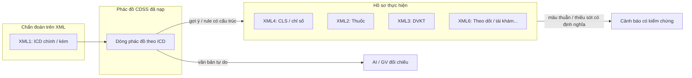

# Phương án triển khai: Kiểm soát phác đồ chuyên môn theo chuỗi lâm sàng — cận lâm sàng — chỉ định

**Mục đích:** Làm rõ cách đáp ứng yêu cầu giám định **chuyên môn** (chẩn đoán / loại trừ → chỉ định CLS, thuốc, DVKT, theo dõi, tái khám) sao cho module Chuyên môn **có giá trị thực**, không dừng ở khớp mã ICD. Tài liệu này là **đặc tả kiến trúc + giao việc AI**; không thay văn bản pháp lý BYT/BHXH.

**Ngày:** 11/04/2026  

---

## 1. Nguyên tắc (giám định vs tự động)

| Nguyên tắc | Giải thích |
|------------|------------|
| **Không “phán xét lâm sàng” bằng một rule cứng** | Sai chỉ định trong biên bản giám định BHYT thường kết hợp **mã, ngữ cảnh, tần suất, tương tác thuốc, tuyến BV** — engine chỉ có thể kiểm tra **tập con** đã **mã hóa được**. |
| **Phác đồ nội bộ = nguồn gợi ý kiểm soát** | Bảng CDSS trong app là **tri thức BV**; muốn “so với hồ sơ” cần **cấu trúc hóa** (mã/thẻ) hoặc **AI có giám sát**. |
| **Minh bạch tầng** | Phân biệt: (A) kiểm tra **có kiểm chứng được** trên XML, (B) gợi ý **cần người/AI** đọc phác đồ và hồ sơ. |

---

## 2. Chuỗi nghiệp vụ mục tiêu (logic giám định chuyên môn)



**Ý nghĩa:** Để rule engine **có ý nghĩa**, phải có **ánh xạ** từ phác đồ (hoặc từ chuyên môn BV) sang **mã có trên XML** (MA_THUOC, MA_DICH_VU, nhóm CLS, v.v.) hoặc sang **câu hỏi kiểm tra** do AI trả lời có cấu trúc.

---

## 3. Dữ liệu XML trong hệ thống (neo kỹ thuật)

| Thành phần | Vai trò trong kiểm soát chuỗi |
|------------|-------------------------------|
| **XML1** | `MA_BENH_CHINH`, `MA_BENH_KT`, `MA_BENHKEM` — neo chẩn đoán; thời gian đợt KCB. |
| **XML4** (`CHI_TIET_CLS`) | Cận lâm sàng / chỉ số — phục vụ “chỉ định xét nghiệm / CLS” nếu có mã và ngày. |
| **XML2** | Thuốc: `MA_THUOC`, `TEN_THUOC`, ngày y lệnh — chỉ định thuốc. |
| **XML3** | DVKT: `MA_DICH_VU`, ngày — chỉ định dịch vụ. |
| **XML5 / XML6** | Diễn biến, xuất viện, `NGAY_HEN_TAI_KHAM` (khi có) — theo dõi / tái khám. |

**Hạn chế:** Không phải mọi “theo dõi lâm sàng” đều có trường số hóa trên XML; một phần chỉ có trong văn bản — đó là chỗ cần **AI hoặc giám định viên**.

---

## 4. Ba tầng giải pháp (triển khai lắp ghép)

### Tầng A — Quy tắc **có cấu trúc** (engine hiện tại, khuyến nghị làm trước)

**Ý tưởng:** Bổ sung **bảng phụ hoặc cột JSON** (trong `tai_lieu` seed / danh mục nội bộ) gắn với **mã ICD đã chuẩn hóa**, ví dụ:

- `DS_MA_DVKT_GOI_Y` — danh sách mã DVKT “thường gắn với phác đồ này” (do BV chốt).
- `DS_MA_THUOC_GOI_Y` hoặc `NHOM_HOAT_CHAT_GOI_Y` (nếu map được sang `MA_THUOC`).
- `BAT_BUOC_CLS: true/false` + `MA_DVKT_XN` tối thiểu (nếu quy trình BV có chuẩn).

**Rule mẫu (No-Code):**  
Ví dụ: *Nếu có ICD trong tập X và `COUNT_IF(XML3, điều kiện MA_DICH_VU)` = 0 → Warning có mã luật riêng.*

**Ưu điểm:** Kiểm chứng được, trích xuất báo cáo, bật/tắt theo khoa.  
**Nhược:** Cần **đầu tư chuẩn hóa danh mục gợi ý** theo BV (không tự sinh từ văn bản phác đồ Excel).

### Tầng B — **Bán cấu trúc** từ bảng phác đồ CDSS hiện tại

**Ý tưởng:** Giữ cột văn bản (“Điều trị đặc hiệu”, “Theo dõi cận lâm sàng”) cho người đọc; đồng thời thêm **một cột** `METADATA_KIEM_SOAT` (JSON) do chuyên môn điền: từ khóa mã, regex MA_*, hoặc tag nội bộ.

**Rule:** Chỉ kiểm tra được những gì đã **chuyển thành mã / tập mã**.

### Tầng C — **AI** (giao việc rõ ràng, không thay người)

**Vai trò:** Đọc **(1) snapshot hồ sơ đã chuẩn hóa** + **(2) dòng phác đồ tương ứng ICD** → trả về **bảng mâu thuẫn có cấu trúc** (không chỉ chat).

**Đầu vào gợi ý (JSON):**

```json
{
  "ma_lk": "...",
  "icd_gop": ["I10", "E11"],
  "tom_tat_xml": {
    "thuoc_ma": ["..."],
    "dvkt_ma": ["..."],
    "co_cls": true
  },
  "phac_do_dong": {
    "muc_tieu": "...",
    "dieu_tri_dac_hieu": "...",
    "theo_doi_can_lam_sang": "...",
    "tai_kham": "..."
  }
}
```

**Đầu ra gợi ý (JSON):**

```json
{
  "muc_do": "GoiY | NghiNgo | KhongDuLieu",
  "muc": [
    {
      "noi_dung": "So sánh gợi ý phác đồ với chỉ định thuốc...",
      "can_cu": "XML2 vs cột Điều trị đặc hiệu",
      "ghi_chu_gv": "Cần xác nhận thủ công"
    }
  ],
  "tu_choi_trach_nhiem": "AI không quyết định thanh toán hay sai chuyên môn."
}
```

**Tích hợp đề xuất:** Màn **Chi tiết ca bệnh** hoặc **Chuyên môn**: nút “**Phân tích phác đồ (AI)**” → gọi API (khi có) → lưu kết quả vào **Tri thức từ giám định** để tích lũy.  
**Trợ lý tri thức nội bộ hiện tại** (`tro_ly_tri_thuc_engine.js`) là **RAG không LLM** — cần **module mới** hoặc **cổng API** nếu muốn suy luận sâu.

---

## 5. Kết luận: Làm gì để module **không vô nghĩa**

1. **Xác định chính sách BV:** Phác đồ nào được coi là “chuẩn kiểm soát” và **ánh xạ sang mã** (ít nhất DVKT/thuốc/CLS mẫu).  
2. **Tầng A:** Thêm rule có cấu trúc theo danh mục gợi ý — đây là phần **sát quy định giám định có kiểm chứng**.  
3. **Tầng C:** Quy trình AI có **schema đầu ra**, lưu vết, **bắt buộc xác nhận GV** trước khi đưa vào “bài học” hệ thống.  
4. **Không** hứa hẹn “engine một rule” suy ra đủ chuỗi lâm sàng từ văn bản phác đồ thuần — cần **cấu trúc hóa + AI có giám sát**.

---

## 6. Liên kết tài liệu trong repo

- **Triển khai mapping ICD ↔ DM thuốc/DVKT BV (nâng cấp, mặc định OFF):** [CDSS_mapping_ICD_DM_thuoc_DVKT_nang_cap.md](./CDSS_mapping_ICD_DM_thuoc_DVKT_nang_cap.md) — mã luật `CDSS_DM_UPGRADE_01` / `02`, file seed `cdss_icd_dm_goi_y_upgrade.seed.json`, engine `cdss_dm_matching_upgrade.jsx`.
- Giới hạn rule CDSS_CM hiện tại: [The_tri_thuc_phac_do_CDSS_chuyen_mon_ICD10_AI.md](./The_tri_thuc_phac_do_CDSS_chuyen_mon_ICD10_AI.md) §4.1  
- DVKT Danh mục 1 (khác tầng phác đồ): [The_tri_thuc_Danh_muc_1_DVKT_dieu_kien_ty_le_gia_VBHN17_AI.md](./The_tri_thuc_Danh_muc_1_DVKT_dieu_kien_ty_le_gia_VBHN17_AI.md)

---

*Tài liệu này là phương án kiến trúc; lựa chọn triển khai code theo lộ trình và nguồn lực chuyên môn tại đơn vị.*
