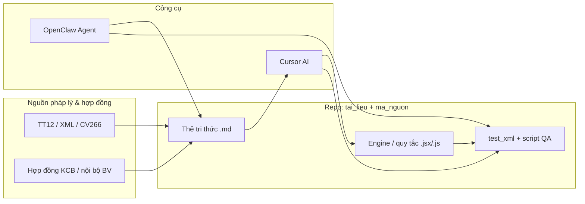

# Quy trình làm việc: Cursor (AI trợ lý mã & tài liệu) + OpenClaw (gateway tự động hóa) cho huấn luyện và vận hành AI giám định BHYT

Tài liệu mô tả **cách phối hợp** giữa trợ lý AI trong **Cursor** và **OpenClaw** nhằm xây dựng, kiểm thử và duy trì hệ thống hỗ trợ giám định bảo hiểm y tế (BHYT) một cách **đầy đủ, có thể lặp lại và áp dụng thực tế**.

## 0. Ranh giới cố định (mọi phiên)

- **Cursor:** sửa **`ma_nguon/`**, script, chạy **`npm run qa:*`** (audit, fixtures, on-off), cập nhật **`test_xml`** / seed, review diff.
- **OpenClaw:** xử lý **tri thức** trong `tai_lieu/`, **báo cáo / checklist / biên bản**, đối chiếu nhiều file; không giả định đã QA trên máy bạn trừ khi bạn dán kết quả.

**Bàn giao chuẩn Cursor → OpenClaw:** [Mau_handoff_Cursor_sang_OpenClaw.md](./Mau_handoff_Cursor_sang_OpenClaw.md).  
**Phiên làm việc chung (copy prompt):** [Phien_lam_viec_chung_Cursor_va_OpenClaw.md](./Phien_lam_viec_chung_Cursor_va_OpenClaw.md).  
**Neo phiên huấn luyện thuốc ↔ engine:** [Bang_neo_phien_huan_luyen_thuoc_va_engine.md](./Bang_neo_phien_huan_luyen_thuoc_va_engine.md).  
**Audit huấn luyện bổ sung (không thay thế snapshot 10 file):** `test_xml/huan_luyen/*.xml` → `test_xml/audit_TRAINHL*_*.json` (chạy `npm run qa:claim-audit`).

---

## 1. Mục tiêu và phạm vi

- **Mục tiêu:** Chuẩn hóa luồng từ *thẻ tri thức / quy định* → *quy tắc & mã* → *bộ ca kiểm thử* → *chạy engine / audit* → *rút kinh nghiệm cập nhật*.
- **Phạm vi:** Repo `ung_dung_cdss_bhyt` (engine giám định, tài liệu `tai_lieu/`, dữ liệu thử `test_xml/`, script QA). OpenClaw đóng vai trò **gateway + agent** (mô hình Google Gemini, workspace trỏ repo, tự động hóa theo lịch hoặc tác vụ nền khi bạn cấu hình).
- **Không mục tiêu:** Thay thế quyết định pháp lý của con người; AI chỉ hỗ trợ kiểm tra, gợi ý và tài liệu hóa lý do.

---

## 2. Vai trò: ai làm gì?

| Khía cạnh | **Cursor (Composer / Chat)** | **OpenClaw (Gateway + Agent)** |
|-----------|------------------------------|--------------------------------|
| **Chỉnh sửa mã** trực tiếp trong repo | Chính: sửa `ma_nguon/`, script, cấu hình | Có thể gọi tool/ghi file nếu bạn bật và tin cậy workspace |
| **Soạn / chỉnh thẻ tri thức, ca huấn luyện** | Rất phù hợp: `tai_lieu/*.md`, cấu trúc bảng, trace ICD–thuốc–DVKT | Phù hợp tóm tắt, draft, đối chiếu nhiều file theo lệnh định kỳ |
| **Chạy lệnh cục bộ** (test, audit) | Qua terminal tích hợp | Qua agent nếu được cấp quyền thực thi |
| **Truy cập mô hình** | Theo cấu hình Cursor | **Gemini** qua `GEMINI_API_KEY` + `auth-profiles.json` (provider `google`) |
| **Bảo mật phiên làm việc** | Theo chính sách Cursor | Token gateway trong `~\.openclaw\openclaw.json`; không commit |

**Nguyên tắc thực tiễn:** Phần **thay đổi mã nguồn quan trọng** và **review diff** nên ưu tiên **Cursor** (diff rõ, kiểm soát phiên bản). OpenClaw phù hợp **tự động hóa lặp lại** (ví dụ: đọc log, nhắc chạy QA, soạn báo cáo ngắn từ kết quả JSON) sau khi bạn đã cố định lệnh và đường dẫn trong repo.

---

## 3. Kiến trúc làm việc (tổng quan)

---

## 4. Chuẩn bị môi trường (một lần, hoặc khi đổi máy)

1. **Repo:** Clone/sync `ung_dung_cdss_bhyt`; workspace OpenClaw trùng thư mục dự án (đã cấu hình trong `agents.defaults.workspace`).
2. **Gemini / Google:** `GEMINI_API_KEY` ở biến môi trường User Windows **và** file `%USERPROFILE%\.openclaw\.env` (gateway đọc ổn định khi chạy service).
3. **OpenClaw:** `openclaw onboard` (hoặc đã có `auth-profiles.json` với `keyRef` → `GEMINI_API_KEY`); `openclaw daemon status` → gateway **running**, port **18789** (mặc định).
4. **Cursor:** Kết nối OpenClaw (nếu dùng extension) với **token gateway mới** sau mỗi lần onboard/đổi `gateway.auth.token` — lấy từ `~\.openclaw\openclaw.json`.
5. **Node / npm:** Đúng phiên bản theo `package.json` để chạy script test/audit trong repo.

---

## 5. Vòng đời huấn luyện & bổ sung tri thức (lặp đi lặp lại)

### 5.1. Từ văn bản pháp lý → thẻ tri thức

1. **Thu thập:** Văn bản chính thức (TT12, CV266, phụ lục), hợp đồng, quy trình BV.
2. **Trong Cursor:** Yêu cầu AI trích xuất **điều kiện áp dụng**, **ngoại lệ**, **trường dữ liệu XML/HSMB** liên quan; xuất ra file mới hoặc cập nhật `tai_lieu/The_tri_thuc_*.md`.
3. **Chuẩn hóa:** Mỗi thẻ nên có: mục đích, phạm vi, input cần có, output mong đợi (mã lỗi / mức độ), **tham chiếu điều khoản**, ví dụ tối thiểu 1 ca.
4. **OpenClaw (tùy chọn):** Giao nhiệm vụ định kỳ “đối chiếu danh sách file `tai_lieu/` với changelog pháp lý” hoặc tóm tắt diff giữa hai phiên bản cùng một chủ đề (sau khi bạn cung cấp hai nguồn văn bản).

### 5.2. Từ thẻ tri thức → quy tắc thực thi (engine)

1. **Ánh xạ:** Với mỗi quy tắc, xác định **bảng dữ liệu** (danh mục thuốc, ICD, DVKT), **trường hồ sơ**, **logic on/off** (đã có pattern trong `ma_nguon/tien_ich/`).
2. **Trong Cursor:** Sửa trực tiếp rule engine / bảng tra cứu; chạy test cục bộ nếu có script.
3. **Ghi chú trong `tai_lieu`:** Cập nhật `Huong_dan_chay_test_AI_chi_tiet.md` hoặc file ca mẫu tương ứng để người sau không phỏng đoán.

### 5.3. Ca huấn luyện (ground truth)

1. Mỗi ca: mô tả bối cảnh, dữ liệu đầu vào (đã **khử danh tính** nếu copy từ thật), kết quả mong đợi, giải thích ngắn.
2. Đặt tại `tai_lieu/Ca_huan_luyen_mau_*.md` hoặc `Danh_sach_10_ca_test_*.md` tương ứng.
3. **Cursor:** Dùng để sinh thêm biến thể ca (edge case) từ một ca gốc — luôn có **người chuyên môn duyệt**.
4. **Gắn engine:** Mỗi phiên huấn luyện thuốc trong repo phải có ít nhất một **MA_LUAT** / built-in + **đường dẫn file mã hoặc seed** — xem bảng tổng hợp [Bang_neo_phien_huan_luyen_thuoc_va_engine.md](./Bang_neo_phien_huan_luyen_thuoc_va_engine.md).

---

## 6. Vòng đời kiểm thử & gắn kết thực tế

1. **Dữ liệu thử:** `test_xml/` (JSON audit nếu có) — không đưa PII thật vào git; dùng mã giả/bệnh án mẫu.
2. **Chạy kiểm tra:** Trong terminal repo, dùng các script đã có (ví dụ `scripts/qa_*.js`, `scripts/qa_on_off_match.mjs` — điều chỉnh theo đúng tên file hiện tại trong repo).
3. **Tiêu chí pass/fail:** Khớp mã lỗi/on-off với tài liệu ca; ghi **lệch** vào issue hoặc file `tai_lieu` dạng “ghi nhận cần sửa rule”.
4. **OpenClaw:** Có thể lên lịch nhắc hoặc chạy lệnh QA sau khi bạn cố định một dòng lệnh duy nhất (ví dụ `node scripts/qa_audit_fixtures.js`) và xác nhận an toàn trên máy.

---

## 7. Phân luồng công việc hằng ngày / hằng tuần

### 7.1. Phiên “cập nhật quy định mới”

| Bước | Thực hiện tại | Hành động |
|------|----------------|-----------|
| 1 | Cursor | Đọc văn bản mới, cập nhật / tạo thẻ tri thức |
| 2 | Cursor | Sửa rule + dữ liệu tra cứu trong `ma_nguon/` |
| 3 | Cursor | Thêm/sửa ca mẫu trong `tai_lieu/` |
| 4 | Terminal / Cursor | Chạy script QA, lưu kết quả |
| 5 | OpenClaw (tuỳ chọn) | Tóm tắt thay đổi + checklist merge cho team |

### 7.2. Phiên “debug một hồ sơ / một XML cụ thể”

| Bước | Thực hiện tại | Hành động |
|------|----------------|-----------|
| 1 | Cursor | Dán cấu trúc dữ liệu đã khử nhạy cảm, mô tả lỗi giám định |
| 2 | Cursor | Trace trong code rule tương ứng; đề xuất sửa |
| 3 | Cursor | Cập nhật ca regression trong `tai_lieu/` |
| 4 | OpenClaw | Có thể hỗ trợ đối chiếu nhanh nhiều đoạn tài liệu nếu bạn đính kèm file |

---

## 8. An toàn dữ liệu và tuân thủ (BHYT / y tế)

- **Không** đưa họ tên, Số thẻ BHYT, CCCD, địa chỉ đầy đủ vào prompt công khai hoặc log không kiểm soát.
- **Không** commit `GEMINI_API_KEY`, token OpenClaw, hoặc `.env` vào git; `~\.openclaw\.env` chỉ trên máy cục bộ.
- Phân loại môi trường: **dev** (dữ liệu giả) vs **UAT** (dữ liệu ẩn danh hóa) vs **production** (chính sách riêng của BV — thường ngoài phạm vi repo này).
- Mọi **kết luận giám định** cuối cùng cần **người có thẩm quyền** xác nhận; AI chỉ là CDSS (hỗ trợ quyết định lâm sàng/quản trị theo định nghĩa nội bộ).

---

## 9. Khắc sự cố thường gặp

| Hiện tượng | Hướng xử lý |
|------------|-------------|
| OpenClaw báo không có API key Google | Kiểm tra `auth-profiles.json` + `%USERPROFILE%\.openclaw\.env` + biến User `GEMINI_API_KEY`; restart gateway. |
| `daemon status` không listen 18789 | `openclaw gateway install` / onboard lại phần daemon; xem log `%TEMP%\openclaw\openclaw-*.log`. |
| Cursor không kết nối OpenClaw | Đồng bộ **token** mới trong `openclaw.json` sau onboard. |
| Rule đúng trên ca mẫu nhưng sai trên XML thật | So khớp **phiên bản danh mục** và **tên trường** mapping XML; bổ sung ca regression từ XML đã ẩn danh. |

---

## 10. Checklist “sẵn sàng huấn luyện / triển khai thêm một nhóm quy tắc”

- [ ] Thẻ tri thức trong `tai_lieu/` có trích dẫn văn bản và phạm vi áp dụng.
- [ ] Mã rule / config đã được review trong Cursor (diff rõ ràng).
- [ ] Ít nhất **một ca** mới trong `tai_lieu/` hoặc bộ test tự động.
- [ ] Đã chạy script QA (nếu có) và ghi kết quả.
- [ ] OpenClaw gateway **running** nếu team dùng agent cho tác vụ nền.
- [ ] Không có bí mật (key, token) trong repo.

---

## 11. Kết luận vận hành

- **Cursor** là nơi **thiết kế, mã hóa và kiểm thử chặt** luồng giám định BHYT trong repo.
- **OpenClaw** là lớp **tự động hóa và tương tác mô hình** trên cùng workspace, hữu ích khi bạn đã **chuẩn hóa lệnh và cấu trúc thư mục**.
- **Huấn luyện đầy đủ** = vòng lặp **pháp lý → thẻ tri thức → rule → ca/QA → sửa → tài liệu hóa**, có người chuyên môn duyệt và có kiểm soát dữ liệu nhạy cảm.

---

**Prompt mẫu chuẩn hóa (copy-paste):** [Prompt_mau_chuan_hoa_BHYT_Cursor_OpenClaw.md](./Prompt_mau_chuan_hoa_BHYT_Cursor_OpenClaw.md)  
**Sprint 60 phút (giám định thuốc):** [Sprint_60p_huan_luyen_giam_dinh_thuoc_Cursor_OpenClaw.md](./Sprint_60p_huan_luyen_giam_dinh_thuoc_Cursor_OpenClaw.md)  
**Phiên làm việc chung (Cursor + OpenClaw, copy prompt):** [Phien_lam_viec_chung_Cursor_va_OpenClaw.md](./Phien_lam_viec_chung_Cursor_va_OpenClaw.md)  
**Phiên huấn luyện tiếp theo (THUOC_391):** [Huan_luyen_phien_02_THUOC_391_Cursor_OpenClaw.md](./Huan_luyen_phien_02_THUOC_391_Cursor_OpenClaw.md)  
**Phiên 03 (đơn >30 ngày — THUOC_418 vs CLN-THUOC-04):** [Huan_luyen_phien_03_THUOC_418_CLN_THUOC_04.md](./Huan_luyen_phien_03_THUOC_418_CLN_THUOC_04.md)  
**Phiên 04 (hạng BV — THUOC_419):** [Huan_luyen_phien_04_THUOC_419_hang_BV.md](./Huan_luyen_phien_04_THUOC_419_hang_BV.md)  
**Mẫu handoff Cursor → OpenClaw:** [Mau_handoff_Cursor_sang_OpenClaw.md](./Mau_handoff_Cursor_sang_OpenClaw.md)  
**Ví dụ regression cảnh báo THUOC/XML (ẩn danh):** [Vi_du_regression_canh_bao_THUOC_XML_an_danh.md](./Vi_du_regression_canh_bao_THUOC_XML_an_danh.md)

*Tài liệu có thể chỉnh sửa theo quy trình nội bộ BV và phiên bản engine trong repo. Cập nhật khi thay đổi cấu trúc thư mục hoặc công cụ OpenClaw.*
